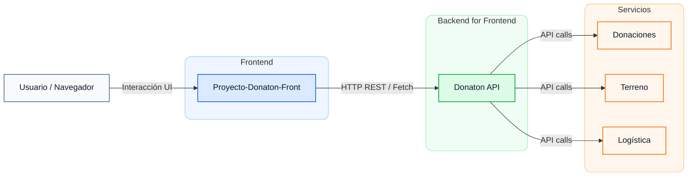

# Donaton React + Vite

Repositorio oficial del proyecto Donaton, una plataforma de donaciones en línea. Este proyecto utiliza React como biblioteca de interfaz de usuario y Vite como herramienta de construcción y desarrollo.

En este repositorio encontrarás el código fuente de la aplicación, así como instrucciones para configurar y ejecutar el proyecto en tu entorno local. Además, se incluyen guías para contribuir al desarrollo del proyecto y reportar problemas.

*Nota: Este proyecto es parte de un sistema más amplio que incluye varios microservicios. Asegúrate de revisar los repositorios relacionados para obtener una visión completa del sistema Donaton.*

## Características
- Funcionalidades para realizar donaciones de manera segura.
- Panel de administración para gestionar donaciones.

## Tecnologías Utilizadas
- **React:** Biblioteca de JavaScript para construir interfaces de usuario.
- **Vite:** Herramienta de construcción y desarrollo rápido para proyectos web.
- **Node.js:** Entorno de ejecución para JavaScript en el servidor.
- **Express:** Framework para construir aplicaciones web en Node.js.

## Diagrama de Arquitectura


La capa `Donaton API` actúa como BFF y centraliza las llamadas hacia los tres servicios.

## Instrucciones para Ejecutar el Proyecto
1. Clona este repositorio:
```bash 
git clone https://github.com/DamagedGhost/proyecto-donaton.git
```

2. Navega al directorio del proyecto:
```bash
cd proyecto-donaton
```

3. Instala las dependencias:
```bash
npm install
```

4. Inicia la aplicación:
```bash
npm run dev
```

*Nota: Asegúrate de tener los microservicios relacionados en ejecución para que la aplicación funcione correctamente.*

## Prueba de componentes donacion, terreno y logistica
Para probar los componentes de donación, terreno y logística, puedes seguir estos pasos:
1. Asegúrate de que los microservicios de donación, terreno y logística estén en ejecución.

2. En el frontend, navega a las secciones correspondientes para cada componente (recomendado haber iniciado sesion con las credenciales indicadas. ***Usuario:*** admin, ***Contraseña:*** admin123).

3. Interactúa con los componentes para realizar donaciones, gestionar terrenos o coordinar logística según sea necesario.

---

Este proyecto es parte de un esfuerzo colaborativo para crear una plataforma de donaciones eficiente y fácil de usar. Componentes estan sujetos a cambios y mejoras continuas, es de conocimiento potenciales riesgos de seguridad, por lo que se recomienda almacenar las rutas de los microservicios en variables de entorno para evitar exponer información sensible en el código fuente.

## Repositorios relacionados
- [Backend de Donaton](https://github.com/DamagedGhost/donaton-api)
- [Microservicio de Donaciones](https://github.com/diegoparra-git/donaton-donaciones)
- [Microservicio de Logística](https://github.com/StevenQR21/donaton-logistica)
- [Microservicio de Terreno](https://github.com/DamagedGhost/donaton-terreno)
